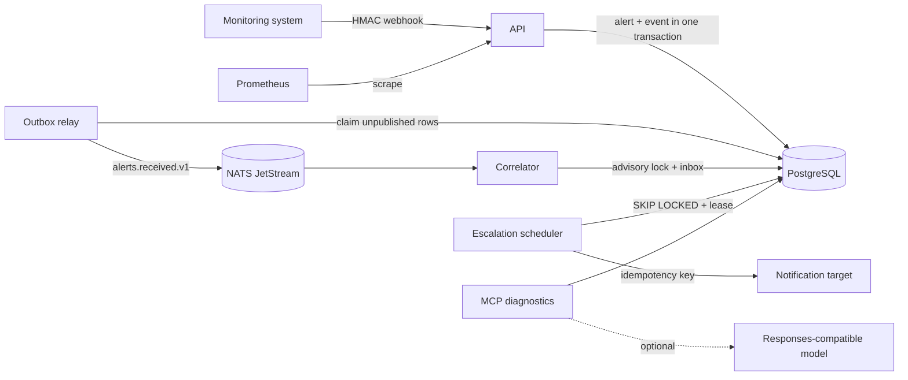
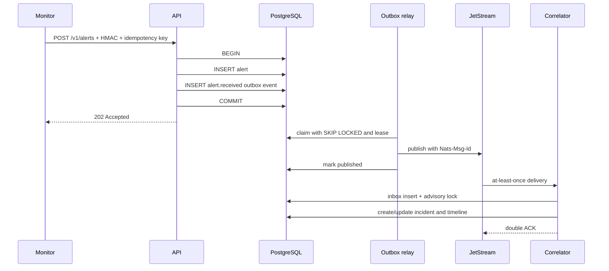

# Architecture

IncidentFlow is intentionally a modular system with three deployable Go binaries, not a collection of thin demo microservices.

## Components

- `cmd/api` authenticates tenants, validates replay-resistant HMAC signatures, commits alerts and outbox events atomically, exposes incident state transitions and Prometheus metrics.
- `cmd/worker` runs the outbox relay, JetStream correlator and durable escalation scheduler. Multiple replicas coordinate through PostgreSQL locks and leases.
- `cmd/mcp` exposes four authenticated, read-only diagnostic tools. AI summarization is optional and outside the critical state-transition path.
- `cmd/migrate` only applies embedded, versioned SQL migrations. `cmd/seed` explicitly creates or refreshes local demo data.

PostgreSQL is the source of truth. The API writes only to PostgreSQL, so a broker outage does not stop ingestion. JetStream transports events with at-least-once delivery; duplicating a broker message must not corrupt business state.

## Alert lifecycle

The advisory transaction lock is derived from `(tenant_id, fingerprint)`. It serializes competing correlators for the same incident while allowing unrelated services to progress concurrently.

## Package boundaries

- `internal/domain`: validation, state machine and event contracts; no infrastructure imports.
- `internal/database`: PostgreSQL transactions, tenant isolation, inbox/outbox and worker claims.
- `internal/messaging`: JetStream topology, publishing and consumer acknowledgement.
- `internal/worker`: relay, correlator, scheduler and notification adapter.
- `internal/httpapi`: transport validation, authentication, error mapping and metrics.
- `internal/mcpapi` and `internal/ai`: read-only tools and replaceable summarization providers.
